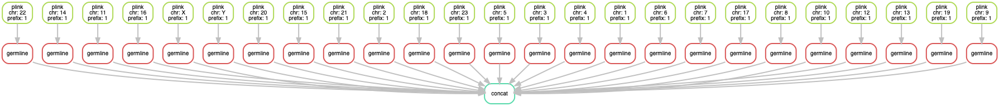

# IBD Segments Pipeline

## Задача

Создать простой пайплайн, который использует plink для преобразования входящих файлов в формате 23andme и передает их на вход germline для поиска и оценки общих сегментов IBD.

В ходе реализации надо учитывать следующие моменты:

1. использовать больше функционала Snakemake, а не скриптов и собственно кода на Python для решения стандартных задач типа создание директорий и временных файлов, обработка входящих параметров и тд
2. думать о параллелизации процесса (например, считать для каждой хромосомы отдельно на каждое ядро) и отказоустойчивости (если процесс прерван, то он должен продолжиться с предыдущего шага с очисткой результатов незавершенного этапа)
3. вести журнал событий, бенчмаркинг и репортинг
4. предусмотреть комплек поставки, который должен быть легко разворачиваемым в любом окружении со всеми зависимостями. бонусом будет оборачивание всего пайпа в докер

## Схема Snakemake пайплайна

